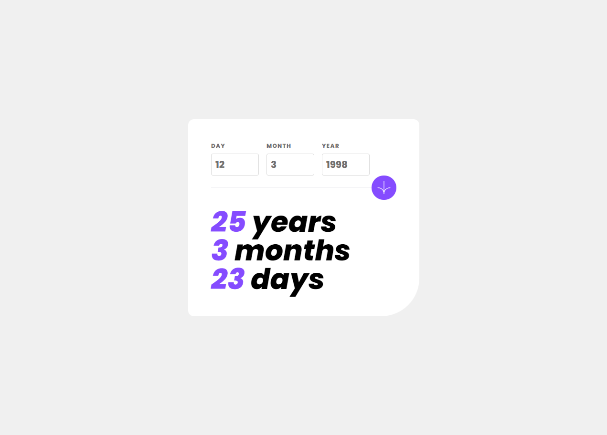
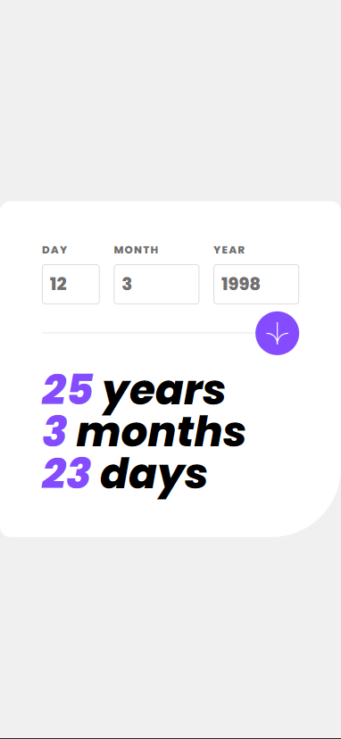
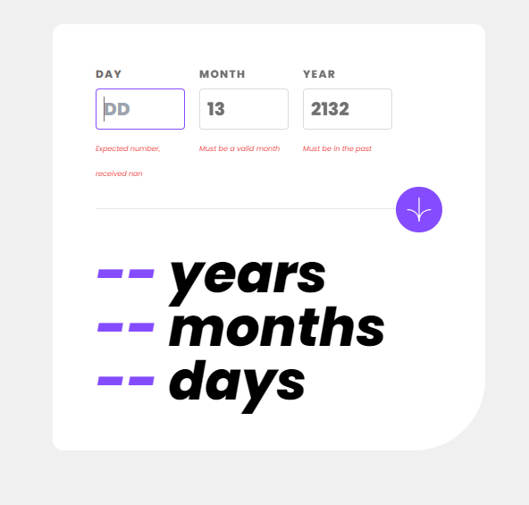

# Frontend Mentor - Age calculator app solution

This is a solution to the [Age calculator app challenge on Frontend Mentor](https://www.frontendmentor.io/challenges/age-calculator-app-dF9DFFpj-Q). Frontend Mentor challenges help you improve your coding skills by building realistic projects. 

## Table of contents

- [Overview](#overview)
  - [The challenge](#the-challenge)
  - [Screenshot](#screenshot)
  - [Links](#links)
- [My process](#my-process)
  - [Built with](#built-with)
  - [What I learned](#what-i-learned)
- [Author](#author)

## Overview

### The challenge

Users should be able to:

- View an age in years, months, and days after submitting a valid date through the form
- Receive validation errors if:
  - Any field is empty when the form is submitted
  - The day number is not between 1-31
  - The month number is not between 1-12
  - The year is in the future
  - The date is invalid e.g. 31/04/1991 (there are 30 days in April)
- View the optimal layout for the interface depending on their device's screen size
- See hover and focus states for all interactive elements on the page
- **Bonus**: See the age numbers animate to their final number when the form is submitted

### Screenshot





### Links

- Solution URL: [Add solution URL here](https://your-solution-url.com)
- Live Site URL: [Add live site URL here](https://your-live-site-url.com)

## My process

### Built with

- Semantic HTML5 markup
- [Next.js](https://nextjs.org/) - React framework
- [TailwindCSS](tailwindcss.com) - For styling
- [React Hook Form](https://react-hook-form.com) - Form validation
- [zod](https://zod.dev) - Form validation

### What I learned

More proficient use of Zod to better form validation:

```ts
const schema = z.object({
  day: z
    .number()
    .min(1, "Must be a valid day")
    .max(31, "Must be a valid day")
    .refine((value) => !isNaN(value), "This field is required")
    .nullable(),
  month: z
    .number()
    .min(1, "Must be a valid month")
    .max(12, "Must be a valid month")
    .refine((value) => !isNaN(value), "This field is required")
    .nullable(),
  year: z
    .number()
    .min(1900, "Must be a year after 1900")
    .max(new Date().getFullYear(), "Must be in the past")
    .refine((value) => !isNaN(value), "This field is required")
    .nullable(),

}).refine((date) => {
  const { day, month, year } = date;
  if (!day && !month && !year) return true;
  const selectedDate = new Date(`${year}-${month}-${day}`);
  const currentDate = new Date();
  return selectedDate <= currentDate;
}, {
  message: "Must be a valid date in the past",
}).refine((date) => {
  const { day, month, year } = date;
  if (!day && !month && !year) return true;

  const lastDayOfMonth = new Date(year, month, 0).getDate();
  return day <= lastDayOfMonth;
}, {
  message: "Must be a valid day of the month"
});
```
## Author
#### 💻 Coded with 💖 by Vinícius Fernandes
[](https://www.facebook.com/viniciusfvb)
[](https://www.linkedin.com/in/viniciusfernandesdev/)
[](https://twitter.com/volafernandes)
<a href = "mailto:viniciusfernandesdev@gmail.com"></a>
<br />
